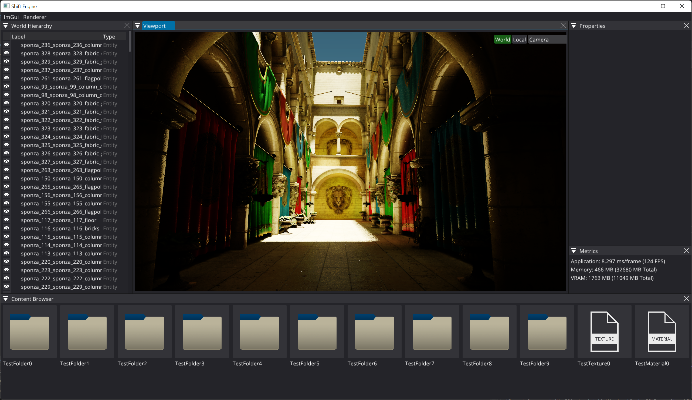

# Shift Engine
## About

Shift Engine is an experimental game-engine built as a hobby project.
We are primarily targeting Windows 64-bit platforms at the moment. Support for other platforms might be added in the future.

## How to build & run the editor
* Download the repository
* Run the GenerateSolution_Editor_ExampleGame.bat script
* Open up the ShiftEngine.sln file with Visual Studio
* Set ExampleGame as startup project.
* Hit F5
