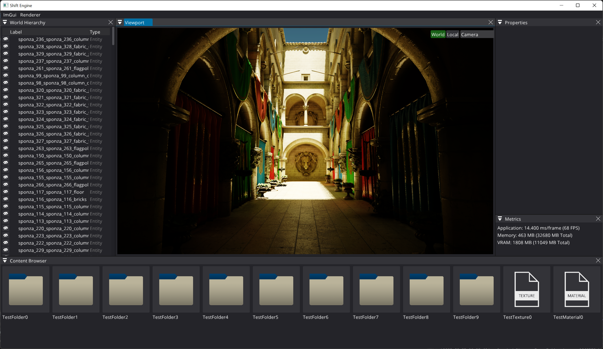

# Shift Engine
## About

Shift Engine is an experimental game-engine built as a hobby project.
We are primarily targeting Windows 64-bit platforms at the moment. Support for other platforms might be added in the future.

## Notable Features
* Based entirely on C++20
* Built exclusively for next generation hardware
* DirectX 12 support
* Geometry meshletization
* Mesh Shading
* Raytraced Diffuse GI
* Raytraced Specular GI (Reflections)
* Raytraced Ambient Occlusion
* Raytraced Shadows
* No baking by default (very quick iteration times)
* Tile-based Forward Rendering
* Asset import driven by Assimp
* ImGui based Editor

## How to build & run the editor
* Download the repository
* Run the GenerateSolution_Editor_ExampleGame.bat script
* Open up the ShiftEngine.sln file with Visual Studio
* Set ExampleGame as startup project.
* Hit F5
